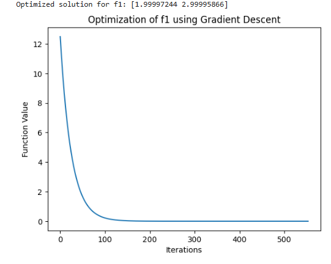
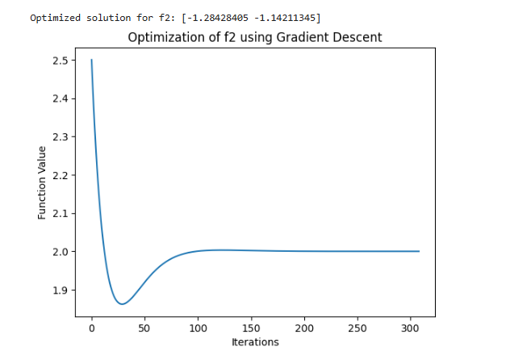

# Machine-Learning-Introduction
Explores randomized matrix and vector operations using NumPy for fundamental mathematical modeling.

## Table of Contents
- [Matrix and Vector Operations](#matrix-and-vector-operations)
- [Gradient Descent](#gradient-descent)
- [Graphs](#graphs)
- [Conclusion](#conclusion)

## Matrix and Vector Operations

The code begins by generating random matrices (X and Y) of sizes 3x4 3×4 and 4x3 , then generates two random vectors (a and b). The logic progresses through various operations:

- Element-wise multiplication of vectors a and b.
- Matrix-vector multiplication using vector a with matrix X.
- Matrix multiplication between X and Y.
- L2 Norm Calculation of vector a to demonstrate vector magnitude computation.

## Gradient Descent

- **Gradient Descent Function:** This function iterates to minimize an objective function (f) by adjusting inputs based on the gradient (df). It halts upon reaching either the iteration limit or a minimal change threshold (tolerance).
- **Objective Functions:** Two sample functions (f1 and f2) with gradients (df1 and df2) demonstrate the application of gradient descent for optimization. f1 minimizes a simple quadratic function, while f2 targets a scaled, non-linear function with a Rosenbrock-like shape.
- **Visualization:** Each function’s optimization process is plotted to show the decrease in function values over iterations, providing insight into convergence rates.

## Graphs

- **Convergence:** The downward trend in the graphs shows the algorithm's progress in minimizing the function, indicating effective learning.
- **Parameter Sensitivity:** Variations in descent rate reflect the effect of parameters like learning rate, showing how they impact optimization speed.
- **Optimization Insight:** Stabilized values indicate convergence, helping gauge when the model has minimized error effectively.

## Conclusion

This introductory project provides a hands-on understanding of matrix operations and gradient-based optimization, foundational tools in machine learning. The matrix manipulations set the stage for working with data, while gradient descent optimization introduces model training concepts. This groundwork is essential for understanding more complex machine learning algorithms, where these operations serve as core building blocks.

